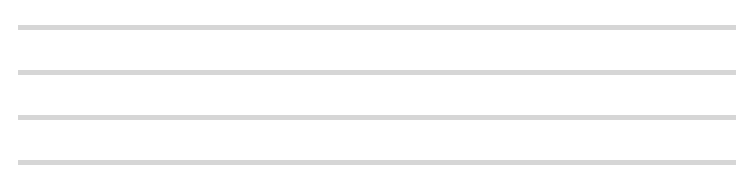
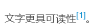
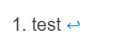
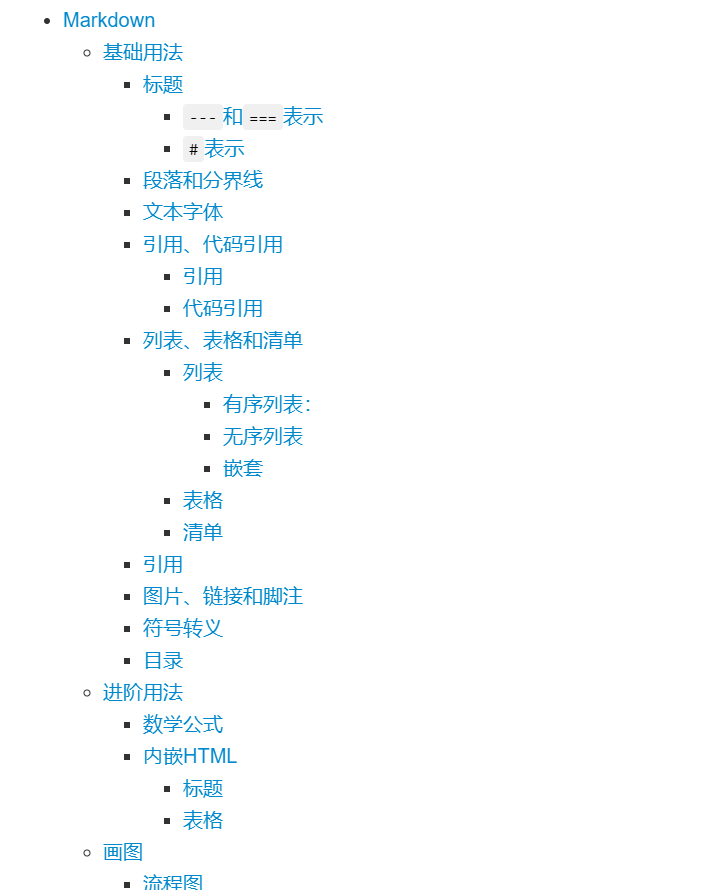
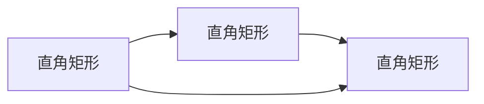

# Markdown
Markdown是一种轻量级**标记语言**，它以纯文本形式编写文档，并最终以**HTML**格式发布，其核心思想是：重文本，轻格式。
## 基础用法
主要涉及文本编写的一些基础用法，比如如何设置标题、添加
### 标题
标题具有两种表示法：  
####  `---`和`===`表示
使用`---`和`===`表示的标题就只有两种层次，语法如下：
```
一级标题
===
二级标题
---
```
  
这种表示方法对`-`或`=`的数量并不做要求，多了并没有什么用，但最少要求为3个，否则没有效果。
####  `#`表示
使用`#`可以表示最多6级标题，第x级标题对应x个`#`。
```
# 一级标题
## 二级标题
### 三级标题
#### 四级标题
##### 五级标题
###### 六级标题
```
  
比较规范的做法是写完`#`后在其后加上一个空格。
### 段落和分界线
Markdwon的段落没有特殊的格式，只需直接写文字即可，而段落的换行的标准格式是在最后打上两个空格后回车。
```
段落1{空格}{空格}{回车}
段落2
```
段落1  
段落2

分界线的使用也非常简单，大概有这么几种：
```
***
* * *

---（上一行需为空行）
___（三个下划线）
```
  
### 文本字体和脚注
#### 文本字体
强调~~或口胡~~文章中的部分内容，更先进的字体自定义方式参照[进阶方法-内嵌HTML](#HTML)。
##### 斜体
_斜体_`_斜体_`
*斜体*`*斜体*`
##### 粗体
**粗体**`**粗体**` 
__粗体__`__粗体__`
##### 粗斜体
***粗斜体***`***粗斜体***` 
___粗斜体___`___粗斜体___`
##### 删除线
~~删除线~~`~~删除线~~`
#### 脚注
脚注是一种对文本的补充说明。文字更具可读性[^脚注]。脚注的内容最终会位于文章的末尾并自动编号。
[^脚注]: test
```
[^脚注] // 标记在某个位置
[^脚注]: test //在其后的任意位置声明脚注的内容
```
效果大概是这样:  
  
在文章的最末尾就会有:
  
### 引用、代码引用
> 引用是指在说话或写作中引用现成的话，如诗句、格言、成语等，以表达自己思想感情的修辞方法。  
> 
总的来说可以分为引用和代码引用。
#### 引用
在文章中引用一段别的地方摘抄过来的文字的时候，有时想要其突出显示，这种时候就可以使用引用：
```
> 引用
> ## 标题
>> 套娃
>>> 套
```
> 引用
> ## 标题
>> 套娃
>>> 套

#### 代码引用
代码引用分为行内代码和块级代码。
```
行内代码只需要将引用的代码用``扩起来就可以，比如`Markdown`。
```
行内代码只需要将引用的代码用``扩起来就可以，比如`Markdown`。
```
    ```c++
    #include<iostream>
    int main() {
        std::cout << "Hello Markdown!" << std::endl;
    }
    ```
```
```c++
    #include<iostream>
    int main() {
        std::cout << "Hello Markdown!" << std::endl;
    }
```
块级代码需要将引用的代码用` ``` `围起来，在第一个` ``` `之后可以加上所使用的语言名称，来对代码进行高亮。
### 列表、表格和清单
#### 列表
列表有两种形式，有序列表和无序列表。
##### 有序列表
```
1. 1
1. 2
200. 3
```
1. 1
1. 2
200. 3

有序列表只需要在需要成为列表的元素前加上`{数字} + .`即可，并不关心前面的数字到底是多少，序号会自动对应并变为有序元素。

##### 无序列表
无序列表需要以`-`、`+`或`*`开头，中间空一格，后跟内容。
```
- 列表1
+ 列表2
* 列表3
```
- 列表1
+ 列表2
* 列表3
##### 嵌套
列表也可以进行一系列嵌套操作，有时候会发现嵌套的内容会粘在一起或显示的层次并不如你所愿的时候，可以尝试换行或空出一行。
```
1. 1
    1的*内容*
1. 2
    2的**内容**
    1. 嵌套列表
    2. 嵌套列表2
        1. 嵌套的嵌套
            嵌套的内容
            * 无序列表
            - 无序列表2
            + 无序列表3

        上一层的内容
        
        2. 嵌套的嵌套2
2. 3
    > 3的引用  

    3的内容
```
1. 1
    1的*内容*
1. 2
    2的**内容**
    1. 嵌套列表
    2. 嵌套列表2
        1. 嵌套的嵌套
            嵌套的内容
            * 无序列表
            - 无序列表2
            + 无序列表3

        上一层的内容

        2. 嵌套的嵌套2
2. 3
    > 3的引用  

    3的内容

#### 表格
表格实际上不是一种Markdown标准语法，但支持Markdown的网站或软件几乎都支持这种非官方的Markdown表格语法。语法如下：  
```
|表头1|表头2|表头3|表头4|
|-|:-|:-:|-:|
|数据1|数据2|数据3|数据4|
```
|表头1|表头222222|表头333333|表头444444|
|-|:-|:-:|-:|
|数据1|数据2|数据3|数据4|

第一行表示表头，经跟一行分隔符，形如`|-|`，并可指定后续数据的对其形式，左对齐`|:-|`，右对齐`|-:|`，居中`|:-:|`。中间的`-`数量并没有规定，可以是任意数量。
#### 清单
清单
- [x] 1
- [ ] 2

### 图片、链接和引用链接
#### 图片

#### 链接

#### 引用链接

### 符号转义
假设有一句话符合markdown语法规则但又不想被markdown解析为词素
### 目录
Markdown有一种生成自动目录的方法，如果标题都以层次分好，那么目录只需要在某个位置加上`[TOC]`即可自动生成，效果大概是：  
  
蓝色部分点击即可跳转。
## 进阶用法
### 数学公式
Markdown兹磁Latex
### 内嵌HTML <span id="HTML"></span>
由于Markdown的本质是将markdon转化为html，因此Markdown可以内嵌多种html标签，甚至包括css。这一部分基本就是html的用法，可以参考HTML的dosc：[链接](https://developer.mozilla.org/zh-CN/docs/Web/HTML "HTML docs")。
#### 标题
```
<h1> h1 </h1>
```


#### 表格
```
<table>
    <tr>
        <td>Foo</td>
        <td>2</td>
    </tr>
    <tr>
        <td>Foo</td>
        <td>2</td>
    </tr>
</table>
```
<table>
    <tr>
        <td>Foo</td>
        <td>2</td>
    </tr>
    <tr>
        <td>Foo</td>
        <td>2</td>
    </tr>
</table>

## 画图
Markdown原生并不支持绘图，绘图部分主要使用`mermaid.js`或`flowchart.js`框架渲染，`flowchart.js`对流程图的支持更好（但我感觉挺丑），下面主要讲`mermaid`在Markdown中的基础使用。
mermaid官方提供的在线编辑器：[连接](https://mermaid-js.github.io/mermaid-live-editor/ "mermaid-live-editor")  

基础语法：
```
    ```mermaid
        {图类型} {参数(如果有的话)}
        {具体内容}
    ```
```
以标记代码块形式编写，需要标注语言为`mermaid`，下跟一行标明图类型，再紧跟图片的具体内容。

### 流程图
基础语法：
```
    ```mermaid
        graph {TB or BT or RL or LR or TD} // 流程图方向参数
        id1{内容} // 内容形状参数
        id2{内容} {箭头} id3{内容} // 箭头种类参数
    ```
```
主要的语法就是`id+{文本内容} {箭头种类} id+{文本内容}` ，其中可以指定文本所在图案的具体形状，以及箭头的种类，流程图的方向等一系列参数。
id为可选内容，不设置id也可以直接设置内容，但id的作用类似于变量，一经声明，再次调用时即可直接使用，不必再次说明内容。

#### 方向参数
其中流程图方向参数决定了该图的方向（总体朝向），具体到每个参数的意义为:
- TB 从上到下
```
    ```mermaid
        graph TB
        A --> B
        B --> C
    ```
```

- BT 从下到上
```
    ```mermaid
        graph BT
        A --> B
        B --> C
    ```
```

- RL 从右到左
```
    ```mermaid
        graph RL
        A --> B
        B --> C
    ```
```

- LR 从左到右
```
    ```mermaid
        graph LR
        A --> B
        B --> C
    ```
```

- TD 同TB
```
    ```mermaid
        graph TD
        A --> B
        B --> C
    ```
```


#### 内容形状
内容形状参数决定了包含文本的图案形状，如果什么都不指定，则默认为直角矩形。
- {id}[] 直角矩形
```
    ```mermaid
        graph LR
        A[直角矩形] --> B[直角矩形]
        B --> C[直角矩形]
        A --> C
    ```
```

- {id}() 圆角矩形
```
    ```mermaid
        graph LR
        A() --> B()
        B --> C()
        A --> C
    ```
```

- {id}>] 不对称矩形
```
    ```mermaid
        graph LR
        A>不对称矩形] --> B>不对称矩形]
        B --> C>不对称矩形]
        A --> C
    ```
```

- {id}{} 菱形
```
    ```mermaid
        graph LR
        A{菱形} --> B{菱形}
        B --> C{菱形}
        A --> C
    ```
```

- {id}(()) 圆形
```
    ```mermaid
        graph LR
        A((圆形)) --> B((圆形))
        B --> C((圆形))
        A --> C
    ```
```


#### 箭头种类  
箭头种类参数决定了指向下一个对象的箭头样式，部分箭头甚至可以在箭头之上标注内容。  
箭头或直线基本以一连串相同的符号来表示，增加该符号会增加箭头的长度，演示图例均以所需最少的符号数来表示，比如：
```
    ```mermaid
        graph LR
        A(内容) --> B(内容) %% 使用了最少的-
        C(内容) ----> D(内容) %% 增加了-的数量来增加箭头的长度
    ```
```
```mermaid
    graph LR
    A(内容) --> B(内容) %% 使用了最少的-
    C(内容) ----> D(内容) %% 增加了-的数量来增加箭头的长度
```
箭头部分符号非常简单，一句话总结大概就是：加`>`代表箭头，不加为直线，`-`为直线，`=`粗直线，`-..-`虚线。  

- 直线箭头
```
    ```mermaid
        graph LR
        A(内容) --> B(内容)
        C(内容) --直线箭头描述--> B(内容)
    ```

```

- 直线(无箭头)
```
    ```mermaid
        graph LR
        A(内容) --- B(内容)
        C(内容) --直线描述--- B(内容) %% 注意-的数量
    ```

```

- 虚线箭头
```
    ```mermaid
        graph LR
        A(内容) -.-> B(内容)
        C(内容) -.虚线箭头描述.-> B(内容)
    ```

```

- 虚线(无箭头)
```
    ```mermaid
        graph LR
        A(内容) -.- B(内容)
        C(内容) -.虚线描述.- B(内容)
    ```

```

- 粗直线箭头
```
    ```mermaid
        graph LR
        A(内容) ==> B(内容)
        C(内容) ==粗直线描述==> B(内容)
    ```

```

- 粗直线(无箭头)
```
    ```mermaid
        graph LR
        A(内容) === B(内容)
        C(内容) ==粗直线描述=== B(内容) %% 注意%的数量
    ```

```

#### 子流程图

#### 自定义样式


### UML

#### 时序图
```
    ```mermaid
        sequenceDiagram 
        客户->>银行柜台: 我要存钱  
        银行柜台->>后台: 改一下这个账户数字哦  
        后台->>银行柜台: 账户的数字改完了，明天起息  
        银行柜台->>客户: 好了，给你回单 ，下一位
    ```
```


### 甘特图

### ER图