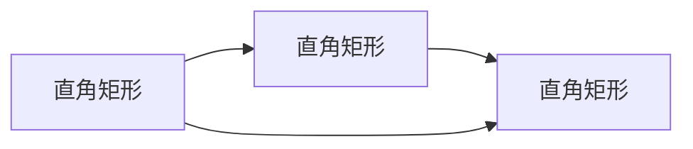
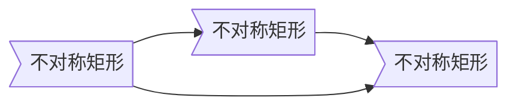

# Markdown
***
To-do List
- [ ] 基础用法
  - [ ] 标题
  - [ ] 段落和分界线
  - [ ] 文本字体
  - [ ] 列表和表格
  - [ ] 引用
  - [ ] 图片、链接和脚注
  - [ ] 表格和清单
  - [ ] 符号转义
  - [ ] 目录
- [ ] 进阶用法
  - [ ] 数学公式
  - [ ] 内嵌HTML 
- [ ] 画图
  - [x] 流程图
  - [ ] UML
  - [ ] 甘特图
  - [ ] ER图
***

Markdown是一种轻量级**标记语言**，它以纯文本形式编写文档，并最终以HTML格式发布，。  
## 基础用法
### 标题
标题具有两种表示法
- `---`和`===`
- `#`

### 段落和分界线

### 文本字体

### 列表和表格

### 引用

### 图片、链接和脚注

### 表格和清单

- [x]
- [ ]

### 符号转义

### 目录

## 进阶用法
### 数学公式

### 内嵌HTML
由于markdown的本质是将markdon转化为html，因此markdown可以内嵌多种html标签，甚至包括css，
```
<table>
    <tr>
        <td>Foo</td>
        <td>2</td>
    </tr>
    <tr>
        <td>Foo</td>
        <td>2</td>
    </tr>
</table>
```
<table>
    <tr>
        <td>Foo</td>
        <td>2</td>
    </tr>
    <tr>
        <td>Foo</td>
        <td>2</td>
    </tr>
</table>

## 画图
Markdown原生并不支持绘图，绘图部分主要使用mermaid-js框架渲染，许多主流的编辑器（如Typora）都已经支持mermaid来进行绘图  
mermaid官方提供的在线编辑器：[连接](https://mermaid-js.github.io/mermaid-live-editor/ "mermaid-live-editor")  

基础语法：
```
    ```mermaid
        {图类型} {参数(如果有的话)}
        {具体内容}
    ```
```
以标记代码块形式编写，需要标注语言为`mermaid`，下跟一行标明图类型，再紧跟图片的具体内容。

### 流程图
基础语法：
```
    ```mermaid
        graph {TB or BT or RL or LR or TD} // 流程图方向参数
        id1{内容} // 内容形状参数
        id2{内容} {箭头} id3{内容} // 箭头种类参数
    ```
```
主要的语法就是`id+{文本内容} {箭头种类} id+{文本内容}` ，其中可以指定文本所在图案的具体形状，以及箭头的种类，流程图的方向等一系列参数。
id为可选内容，不设置id也可以直接设置内容，但id的作用类似于变量，一经声明，再次调用时即可直接使用，不必再次说明内容。

#### 方向参数
其中流程图方向参数决定了该图的方向（总体朝向），具体到每个参数的意义为:
- TB 从上到下
```
    ```mermaid
        graph TB
        A --> B
        B --> C
    ```
```

- BT 从下到上
```
    ```mermaid
        graph BT
        A --> B
        B --> C
    ```
```

- RL 从右到左
```
    ```mermaid
        graph RL
        A --> B
        B --> C
    ```
```

- LR 从左到右
```
    ```mermaid
        graph LR
        A --> B
        B --> C
    ```
```

- TD 同TB
```
    ```mermaid
        graph TD
        A --> B
        B --> C
    ```
```


#### 内容形状
内容形状参数决定了包含文本的图案形状，如果什么都不指定，则默认为直角矩形。
- {id}[] 直角矩形
```
    ```mermaid
        graph LR
        A[直角矩形] --> B[直角矩形]
        B --> C[直角矩形]
        A --> C
    ```
```

- {id}() 圆角矩形
```
    ```mermaid
        graph LR
        A() --> B()
        B --> C()
        A --> C
    ```
```

- {id}>] 不对称矩形
```
    ```mermaid
        graph LR
        A>不对称矩形] --> B>不对称矩形]
        B --> C>不对称矩形]
        A --> C
    ```
```

- {id}{} 菱形
```
    ```mermaid
        graph LR
        A{菱形} --> B{菱形}
        B --> C{菱形}
        A --> C
    ```
```

- {id}(()) 圆形
```
    ```mermaid
        graph LR
        A((圆形)) --> B((圆形))
        B --> C((圆形))
        A --> C
    ```
```


#### 箭头种类  
箭头种类参数决定了指向下一个对象的箭头样式，部分箭头甚至可以在箭头之上标注内容。  
箭头或直线基本以一连串相同的符号来表示，增加该符号会增加箭头的长度，演示图例均以所需最少的符号数来表示，比如：
```
    ```mermaid
        graph LR
        A(内容) --> B(内容) %% 使用了最少的-
        C(内容) ----> D(内容) %% 增加了-的数量来增加箭头的长度
    ```
```
```mermaid
    graph LR
    A(内容) --> B(内容) %% 使用了最少的-
    C(内容) ----> D(内容) %% 增加了-的数量来增加箭头的长度
```
箭头部分符号非常简单，一句话总结大概就是：加`>`代表箭头，不加为直线，`-`为直线，`=`粗直线，`-..-`虚线。  

- 直线箭头
```
    ```mermaid
        graph LR
        A(内容) --> B(内容)
        C(内容) --直线箭头描述--> B(内容)
    ```

```

- 直线(无箭头)
```
    ```mermaid
        graph LR
        A(内容) --- B(内容)
        C(内容) --直线描述--- B(内容) %% 注意-的数量
    ```

```

- 虚线箭头
```
    ```mermaid
        graph LR
        A(内容) -.-> B(内容)
        C(内容) -.虚线箭头描述.-> B(内容)
    ```

```

- 虚线(无箭头)
```
    ```mermaid
        graph LR
        A(内容) -.- B(内容)
        C(内容) -.虚线描述.- B(内容)
    ```

```

- 粗直线箭头
```
    ```mermaid
        graph LR
        A(内容) ==> B(内容)
        C(内容) ==粗直线描述==> B(内容)
    ```

```

- 粗直线(无箭头)
```
    ```mermaid
        graph LR
        A(内容) === B(内容)
        C(内容) ==粗直线描述=== B(内容) %% 注意%的数量
    ```

```

#### 子流程图

#### 自定义样式


### UML

#### 时序图
```
    ```mermaid
        sequenceDiagram 
        客户->>银行柜台: 我要存钱  
        银行柜台->>后台: 改一下这个账户数字哦  
        后台->>银行柜台: 账户的数字改完了，明天起息  
        银行柜台->>客户: 好了，给你回单 ，下一位
    ```
```


### 甘特图

### ER图